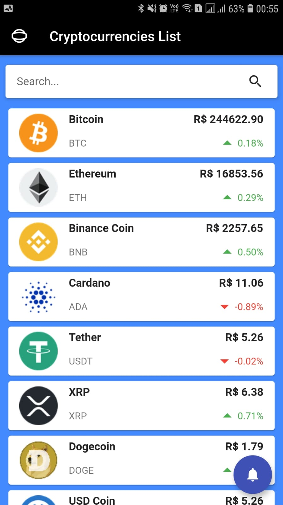

# Cryptocurrencies List

A Simple Cryptocurrencies Listing App built with Flutter that show prices and other information of the most popular cryptocurrencies.



## Information

This application utilizes a free tier of the CoinMarketCap Professional API. You can get your API key [here](https://pro.coinmarketcap.com/pricing).

## Instructions

By default the Api Key is stored in a .env file. It's necessary to create the file in the root of application with the following content:
```dotenv
   CMC_API = 'XXXXXXXX-XXXX-XXXX-XXXX-XXXXXXXXXXXX'
   ```
